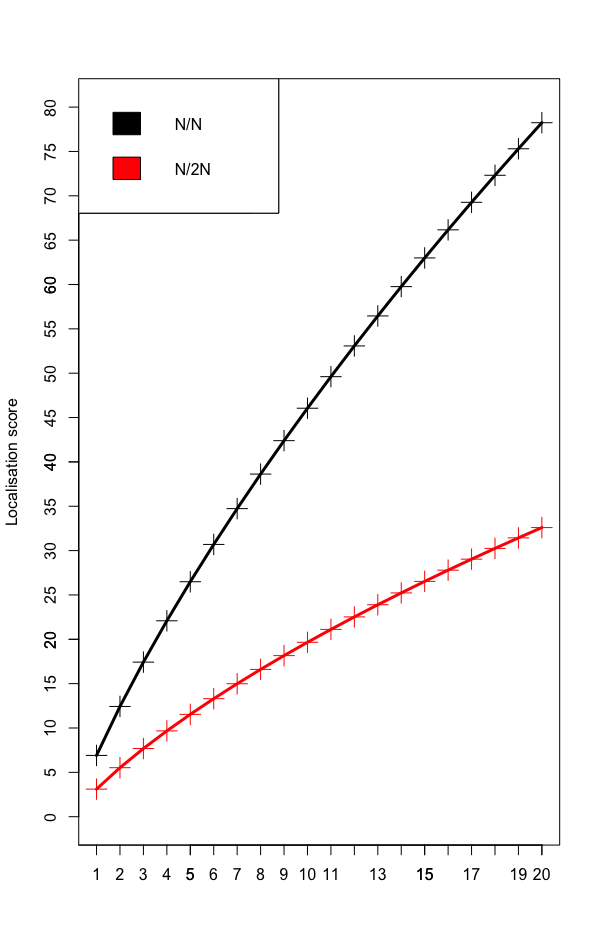

# ifCNV : a novel isolation-forest-based package to detect copy number variations from various NGS datasets.

## Installation

### From PyPi (recommended)

Make sure you have python >= 3.6

```sh
$ python --version
Python 3.X.X
```

Install pip (https://pip.pypa.io/en/stable/installation/).

```sh
$ python -m ensurepip --upgrade
```

Install ifCNV (https://pypi.org/project/ifCNV/)

```sh
$ pip install ifCNV
```

## Users Guide

### Basic usage

ifCNV creates the output directory in wich it stores the html report that will open automatically.

```sh
$ ifCNV -i /path/to/bam/directory/ -b /path/to/bed/file -o /path/to/output/directory/
```

### More specific commands:

- if you want ifCNV to stop talking
```sh
$ ifCNV -i /path/to/bam/directory/ -b /path/to/bed/file -o /path/to/output/directory/ -v ''
```
- if you don't want ifCNV to automatically open the report
```sh
$ ifCNV -i /path/to/bam/directory/ -b /path/to/bed/file -o /path/to/output/directory/ -a ''
```
- if you don't want to re-create the reads matrix of your run at each utilisation (ie. to rerun ifCNV with different parameters)
  - First, run ifCNV and write the reads matrix
  - Then, run ifCNV and tell it to take the reads matrix (it will skip its creation)

```sh
$ ifCNV -i /path/to/bam/directory/ -b /path/to/bed/file -o /path/to/output/directory/ -rm /path/to/readsMatrix/file

$ ifCNV -i /path/to/bam/directory/ -b /path/to/bed/file -o /path/to/output/directory/ -s /path/to/readsMatrix/file
```
- if you want to save the output in a .tsv file (it will be written in the output directory)
```sh
$ ifCNV -i /path/to/bam/directory/ -b /path/to/bed/file -o /path/to/output/directory/ -sv True
```
- changing mode from 'fast' (default) to 'extensive', will take a bit longer but doing so ifCNV will check every sample of the run for altered targets
```sh
$ ifCNV -i /path/to/bam/directory/ -b /path/to/bed/file -o /path/to/output/directory/ -m 'extensive'
```

### Resolution

The resolution of ifCNV is the smallest region covered by a target. It is set in the .bed file. The 4th column of the .bed file must be the name of the targeted region. ifCNV splits this name on the "\_" character and regroups whats on the left of it as the region of interest. 

Exemples:
```
1	65300120	65300271	JAK1_E25_STA100319	0	+	65300140	65300249	255,0,0
1	65300220	65300383	JAK1_E25_STA100320	0	+	65300246	65300353	255,0,0
1	65300278	65300427	JAK1_E25_STA100321	0	+	65300296	65300393	255,0,0
1	65301022	65301161	JAK1_E24_STA100322	0	+	65301046	65301143	255,0,0
1	65301065	65301228	JAK1_E24_STA100323	0	+	65301085	65301202	255,0,0
```
Using this .bed file, the resolution will be at the gene level, meaning the five amplicons will be considered as belonging to the same region (JAK1) in the calculus of the localisation score.

```
1	65300120	65300271	JAK1-E25_STA100319	0	+	65300140	65300249	255,0,0
1	65300220	65300383	JAK1-E25_STA100320	0	+	65300246	65300353	255,0,0
1	65300278	65300427	JAK1-E25_STA100321	0	+	65300296	65300393	255,0,0
1	65301022	65301161	JAK1-E24_STA100322	0	+	65301046	65301143	255,0,0
1	65301065	65301228	JAK1-E24_STA100323	0	+	65301085	65301202	255,0,0
```
Using this .bed file, the resolution will be at the exon level, meaning the 3 first will be considered as belonging to the same region (JAK1-E25) and the 2 last to another region (JAK1-E24) in the calculus of the localisation score.

This implies a careful consideration to the localisation score threshold (-sT). Indeed, the localisation score depends on the size of th region of interest. For example, 3 altered targets on 3 targets of the region of interest will have a smaller localisation score than 10 altered targets on 10 targets of the region of interest (see image below).





